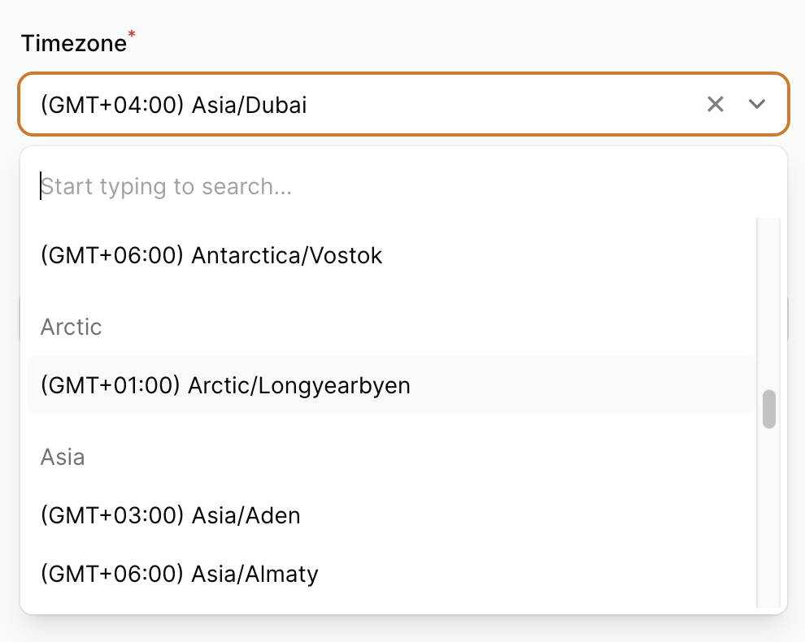
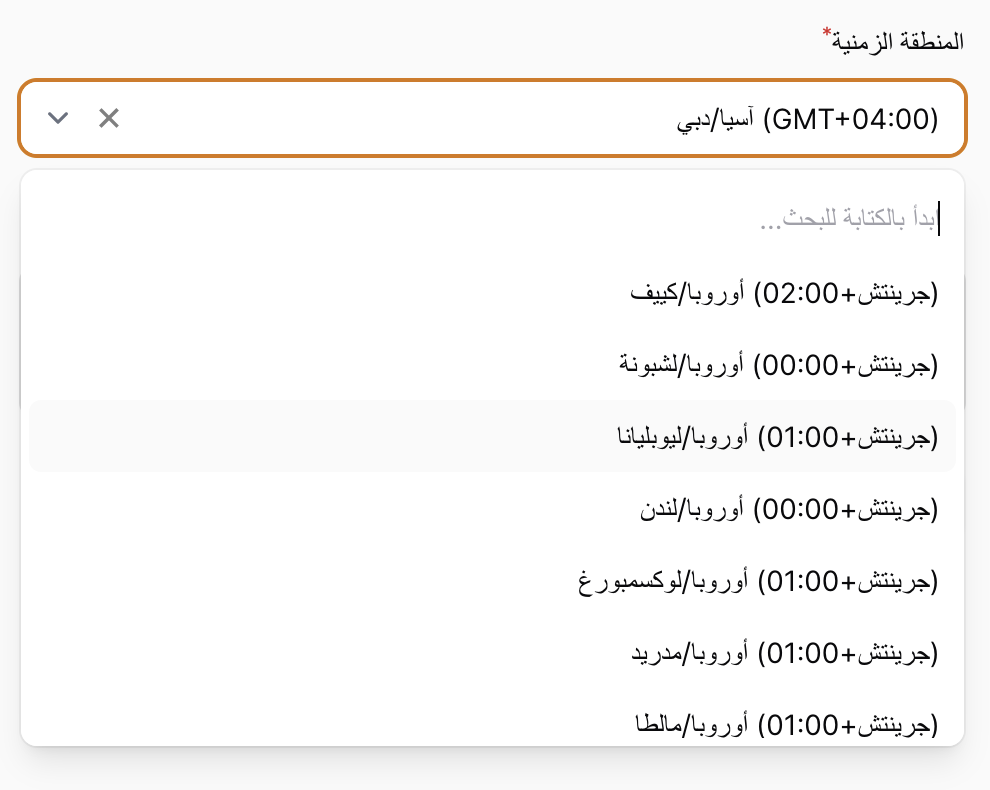

# Laravel Filament Timezone Field

[](https://packagist.org/packages/omar-haris/filament-timezone-field)
[](https://github.com/omar-haris/filament-timezone-field/actions?query=workflow%3Arun-tests+branch%3Amain)
[](https://github.com/omar-haris/filament-timezone-field/actions?query=workflow%3A"Fix+PHP+code+style+issues"+branch%3Amain)
[](https://packagist.org/packages/omar-haris/filament-timezone-field)
[](https://github.com/omar-haris/filament-timezone-field)

A Laravel Filament component that enables users to choose a specific timezone grouped by regions, with support for multiple languages.

 

## Requirements

- PHP 8.1^
- Filament v3

## Installation

You can install the package via composer:

```bash
composer require omar-haris/filament-timezone-field
```
You can publish the translation languages files with:

```bash
php artisan vendor:publish --tag="filament-timezone-field-translations"
```
Supported languages

- Arabic
- English

## Usage

#### Add to your filament form resource:

```php
use OmarHaris\FilamentTimezoneField\Forms\Components\Timezone as TimezoneComponent;
 
public static function form(Form $form): Form
{
    return $form
        ->schema([
            // ...
            TimezoneComponent::make('timezone')
                ->searchable()
                ->required(),
            // ...
        ]);
}
```

#### Add to your filament table resource:

```php
use OmarHaris\FilamentTimezoneField\Tables\Columns\Timezone as TimezoneColumn;
 
public static function form(Form $form): Form
{
    return $form
        ->columns([
            // ...
            TimezoneColumn::make('timezone')
                ->sortable()
                ->toggleable(),
            // ...
        ]);
}
```

#### You can use it as a table filter
```php
use OmarHaris\FilamentTimezoneField\Tables\Filters\Timezone as TimezoneFilter;

public static function table(Table $table): Table
{
    return $table
        //...
        ->filters([
            TimezoneFilter::make('timezone'),
            // ...
        ])
}
```

## Testing

```bash
composer test
```

## Changelog

Please see [CHANGELOG](CHANGELOG.md) for more information on what has changed recently.

## Contributing

Please see [CONTRIBUTING](CONTRIBUTING.md) for details.

## Security Vulnerabilities

Please review [our security policy](../../security/policy) on how to report security vulnerabilities.

## Credits

- [Omar Haris](https://github.com/omar-haris)
- [All Contributors](../../contributors)

## License

The MIT License (MIT). Please see [License File](LICENSE.md) for more information.
